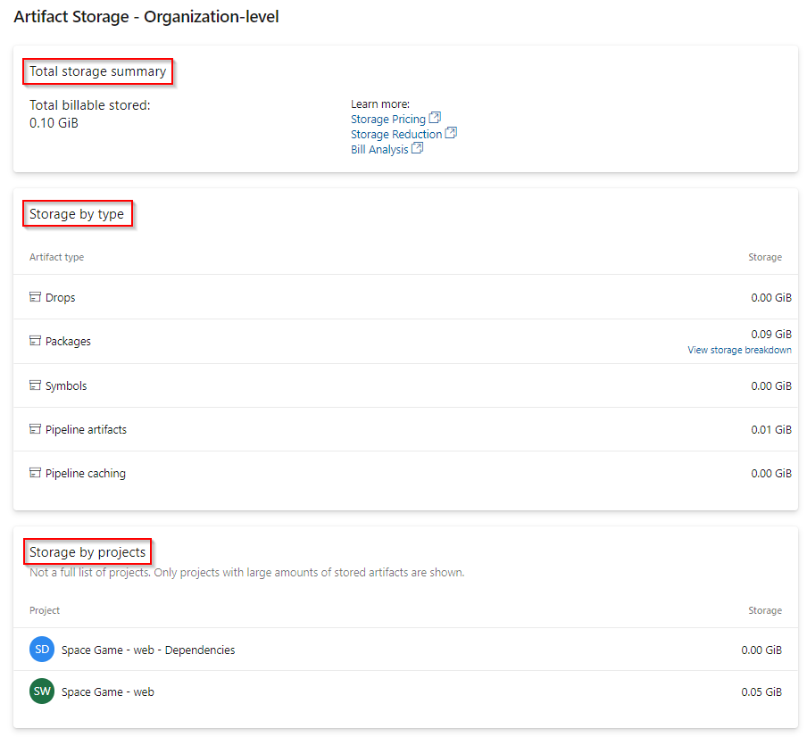
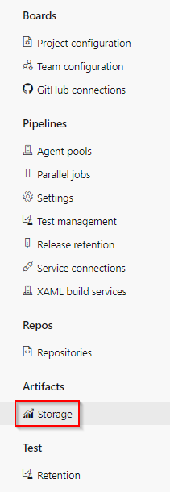
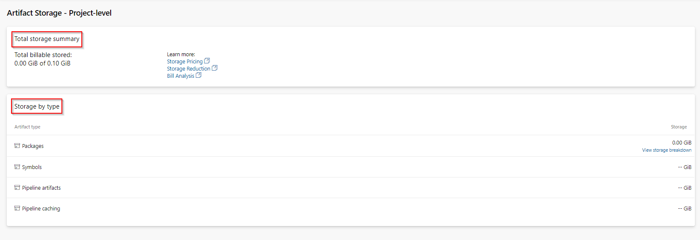

# Artifact Storage breakdown

[!INCLUDE [temp](../includes/version-tfs-2017-through-vsts.md)]

Azure Artifacts offers a free tier plan that includes 2 GiB of free storage for different types of packages. Once you reach your maximum storage limit, you can either upgrade to a paid subscription or delete some of your existing artifacts.

Starting November 1st 2020, Azure Artifacts will be switching to a consumption-based billing for all package types (NuGet, npm, Python, Maven, and Universal packages). Symbols storage will be free for now and billing it will be deferred to a later time. For more information on the billing changes, check out the [Billing changes](https://devblogs.microsoft.com/devops/azure-artifacts-billing-changes-coming-october-2020/) blog post.

> [!NOTE]
> Organizations created prior to May 6th 2019 will remain on the per-subscription billing and will switch over to per-storage usage billing starting from November 1st 2020.

To have a better view of your storage consumption, Azure Artifacts is introducing a new user interface for Artifact Storage to view your consumption from both an organization and a project levels. Storage will also be grouped by type and/or by projects. More levels of granularity will be developed in the near future.

## Organization-level storage

The organization-level view will show you your total storage summary and your storage consumption by Artifact type and by project.

1. From within your organization, select  **Organization settings**.

1. Under Artifacts, select **Storage** in the left navigation pane.

    > [!div class="mx-imgBorder"]
    > 

1. View your storage consumption for each section.

    > [!div class="mx-imgBorder"]
    > 

For the current release, users will be able to view the storage breakdown for **packages** as well as projects listed under the **Storage by projects** section. We will be adding more levels of granularity in future releases.

The **Packages** storage breakdown view will list packages in organization-scoped feeds.

> [!div class="mx-imgBorder"]
> 

> [!NOTE]
> The **Storage by projects** section will only show projects with the largest storage consumption and not the full list of projects in your organization.

## Project-level storage

The project-level view will show you your total storage summary as well as your storage consumption by Artifact type.

1. From within your project, select  **Project settings**.

1. Under Artifacts, select **Storage** in the left navigation pane.

    > [!div class="mx-imgBorder"]
    > 

1. View your total storage summary and your storage by Artifact type.

    > [!div class="mx-imgBorder"]
    > 

Your total storage summary will show you your total billable stored Artifacts. The storage by type section will list your storage consumption by Artifact type. For the current release, you can view your storage breakdown for **Packages** section only. The other sections will be added in future releases.

## What's next?

- [What are feeds](concepts/feeds.md)
- [What are feed views](concepts/views.md)
- [Get started with NuGet packages](get-started-nuget.md)
- [Publish to NuGet feeds (YAML/Classic)](../pipelines/artifacts/nuget.md)