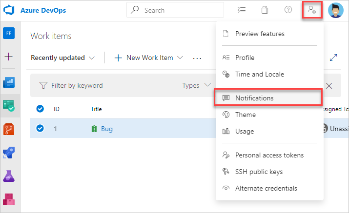
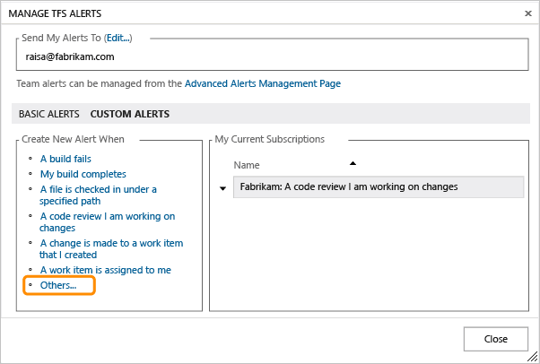
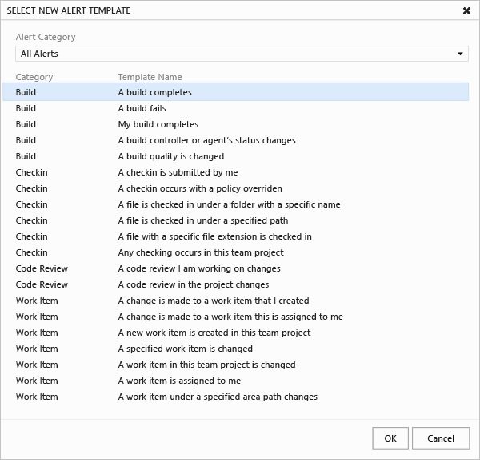
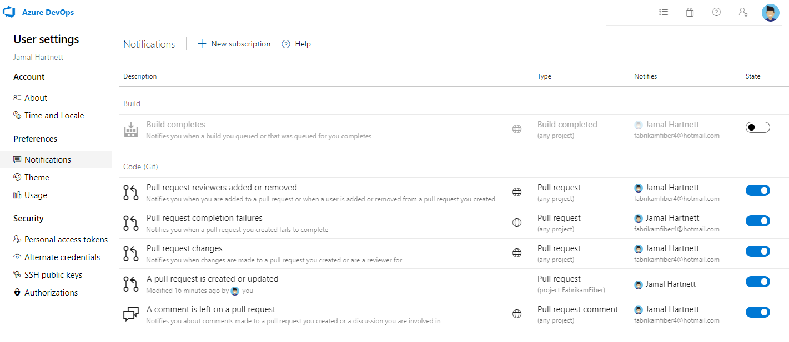
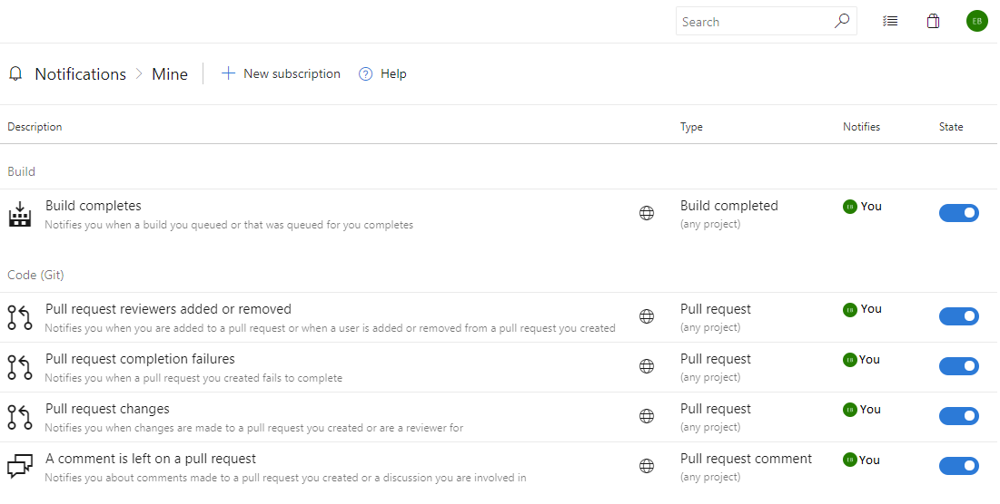
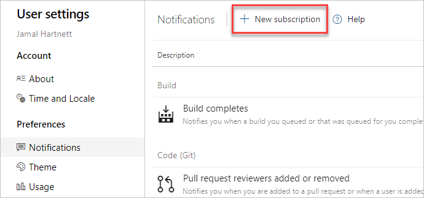

# Manage your personal notifications

[!INCLUDE [version-all](../includes/version-all.md)]

You can get email notifications sent to just yourself, as changes occur to the following items:
- work items 
- code reviews
- pull requests
- source control files
- builds

For example, get email notifications whenever a bug that you opened gets resolved or when you're assigned to a work item. Set personal notifications, as described in this article, or set [team or group notifications](manage-team-group-global-organization-notifications.md).

[!INCLUDE [note-earlier-tfs-version](includes/note-earlier-tfs-version.md)]

::: moniker range=">= tfs-2017"  

Learn how to do the following tasks:

> [!div class="checklist"]
> * View your personal notifications
> * View and edit all subscriptions
> * Add a custom subscription
> * Unsubscribe or opt out of a team or out-of-the-box (OOB) subscription

::: moniker-end  

[!INCLUDE [note-smtp-server](includes/note-smtp-server.md)]

::: moniker range="azure-devops"  

## View your personal notifications

> [!NOTE]   
> To enable the new user interface for the Project Permissions Settings Page, see [Manage or enable features](../project/navigation/preview-features.md).

#### [Preview page](#tab/preview-page) 

From the web portal, select the user icon, and then select **Notifications** from the resulting list.

     

#### [Current page](#tab/current-page) 

From the web portal, select the icon with your initials or picture, and then select **Notification settings** from the drop-down menu.

     

***

::: moniker-end  

::: moniker range=">= tfs-2017 < azure-devops"  

> [!div class="mx-imgBorder"] 
> 
::: moniker-end

::: moniker range="< tfs-2017"  

## Set alerts just for yourself

1. Open **My alerts** from your profile menu. If you don't see this option, then  [configure an SMTP server to support TFS](/azure/devops/server/admin/setup-customize-alerts). 
	
	

2. Enter one or more email addresses. Separate addresses with a semi-colon. 
	
	  

3.	Select the check box for each alert of interest. **My work items** and **My build** refer to work items and builds that you created.
	
	

	Alert templates reference a customizable query. 
	
	The following alert types appear when your project is provisioned with Git for version control:  
	- **A commit is pushed to this project**  
	- **A pull request I've participated in is created or updated**  
	- **A build quality changes** 

	> [!TIP]    
	> When you clear an alert, you also clear all email addresses defined for the alert.  

4.	For more options, open custom alerts and choose one of the options available. Also, you can open a basic alert and modify its settings, such as change the email format from HTML to plain text or SOAP. 
	
	

5.	Define alert filters in the same way you define query filters.
	
	
	
	For a list of available fields, see [Index of work item fields](../boards/work-items/guidance/work-item-field.md).

6.	For even more options, open the Select New Alert Template. 
	
	

7.	Choose from one of the several alert types listed.
	
	

::: moniker-end  

::: moniker range=">= tfs-2017"  

## View and edit all subscriptions

This view shows all subscriptions that you've created or that have been created by an administrator. Subscriptions let you control what you are notified about. Subscribed notifications are indicated with the State as **On**.

::: moniker-end  

::: moniker range="azure-devops"  

> [!NOTE]   
> To enable the new user interface for the Project Permissions Settings Page, see [Manage or enable features](../project/navigation/preview-features.md).

#### [Preview page](#tab/preview-page) 

> [!div class="mx-imgBorder"]  
> 

#### [Current page](#tab/current-page) 

> [!div class="mx-imgBorder"]  
> 

***

::: moniker-end  

::: moniker range=">= tfs-2017 < azure-devops"

:::image type="content" source="media/unsubscribe-personal-notifications.png" alt-text="Screenshot of unsubscribe from notification subscriptions."::: 

::: moniker-end

::: moniker range=">= tfs-2017"

A subscription can be just for you, or if you're a team admin, can be shared by everyone in the team.

::: moniker-end  

::: moniker range=">= tfs-2017"

## Add a custom subscription

With custom personal subscriptions, you can define precise criteria for the events you want to receive notifications. A custom subscription can notify you about any event. Default subscriptions differ, as they only notify users or groups directly associated with an event.

::: moniker-end  

::: moniker range="azure-devops"  

> [!NOTE]   
> To enable the new user interface for the Project Permissions Settings Page, see [Manage or enable features](../project/navigation/preview-features.md).

#### [Preview page](#tab/preview-page) 

1. From your **Notifications** page, select **New subscription**.

	

1. Choose the category and template you want to use, and then select **Next**. For a list of supported templates, see [Default and supported notifications](oob-built-in-notifications.md).

	Here we choose to get notified when a pull request is created within a specific project, Fabrikam Fiber.

	:::image type="content" source="media/manage-personal-notifications-new-subscription-dialog-preview.png" alt-text="Screenshot of new subscription-selected category and template.":::

1. Modify the description to help you identify the subscription later. Also, choose an email address for the notifications to be delivered to. By default, your preferred email address is used. Optionally, include one or more fields to further specify the event criteria.

	:::image type="content" source="media/manage-personal-notifications-complete-pull-request-subscription-preview.png" alt-text="Screenshot of updated subscription dialog with field criteria.":::

	> [!NOTE]   
	> The fields available for filtering event criteria differ depending on the category and template you select. For more information about event types, see [Supported event types](oob-supported-event-types.md).   

1. Select **Finish** when you're done. The subscription now appears in the list under the category you selected.

	:::image type="content" source="media/manage-personal-notifications-subscription-added-preview.png" alt-text="Screenshot of confirmation of new subscription added.":::

#### [Current page](#tab/current-page) 

1. From your **Notifications** page, select **New subscription**.

   

1. Choose the category and template you want to use. For a list of supported templates, see [Default and supported notifications](oob-built-in-notifications.md).

	Here we choose to get notified when a pull request is created within a specific project, Fabrikam Fiber.
	
    :::image type="content" source="media/manage-personal-notifications-new-subscription-dialog.png" alt-text="Screenshot of personal notifications new subscription dialog.":::

1. Modify the description to help you identify the subscription later. Also, choose an email address for the notifications to be delivered to. By default, your preferred email address is used. Optionally, include one or more fields to further specify the event criteria.

	:::image type="content" source="media/manage-personal-notifications-complete-pull-request-subscription.png" alt-text="Screenshot of new subscription event criteria.":::

	> [!NOTE]   
	> The fields available for filtering event criteria differ depending on the category and template you select. For more information about event types, see [Supported event types](oob-supported-event-types.md).  

1. Select **Finish** when you're done. The subscription now appears on the list under the category that you selected.

	:::image type="content" source="media/manage-personal-notifications-subscription-added.png" alt-text="Screenshot showing the subscription on the list under its category.":::

::: moniker-end  

***
::: moniker range=">= tfs-2017 <= tfs-2018"  

   

1. Choose the category and template you want to use. For a list of supported templates, see [Default and supported notifications](oob-built-in-notifications.md).

	Here we choose to get notified when a pull request is created within a specific project, Fabrikam Fiber.

	

1. Modify the description to help you identify the subscription later. Also choose an email address for notifications to be delivered to. By default, your preferred email address is used. optionally, include one or more fields to further specify the event criteria.

	

	> [!NOTE]   
	> The fields available for filtering event criteria differ depending on the category and template you select.   

1. Select **Finish** when you're done. The subscription now appears in the list under the category you selected.

	

::: moniker-end

[!INCLUDE [opt-out-notification](includes/opt-out-notification.md)]

## Related articles

- [Manage your personal notifications](manage-your-personal-notifications.md)
- [Set your preferences](../organizations/settings/set-your-preferences.md)
- [Default and supported notifications](oob-built-in-notifications.md)
- [Follow a specific work item](../boards/work-items/follow-work-items.md)  
- [Change your preferred email address](change-email-address.md)

### Limitations

* The user interface no longer supports creating plain text email subscriptions.

<!--- TFS 2017 Update 1 settings 

To manage your notification settings, select the Notifications option under the profile menu:
	

Learn more about [team subscriptions](./manage-team-group-global-organization-notifications.md).

From this view, you can create, edit, disable, or delete custom subscriptions that you have created for yourself. You can also see shared team subscriptions.

## Create a subscription

1. From your Notifications, choose **New**.
	
3. Select the type of activity you want to be notified about.
	
	

4. Provide a description to help you identify the subscription later. Also choose an email address for notifications to be delivered to. By default, your preferred email address is used.

	

5. Choose whether you want to receive notifications about activity in all projects or only a specific project.

	

6. Optionally configure additional filter criteria.

	

7. Select **Finish** to save the new subscription.

## Opt out of a team subscription

You can choose to not receive notifications for certain team subscriptions by opt'ing out of the subscription.

1. Open your notifications settings from the profile menu.
	
	

2. Find the team subscription in the shared subscriptions section.

	

3. Move the toggle to opt out of receiving notifications for this subscription.

    

-->