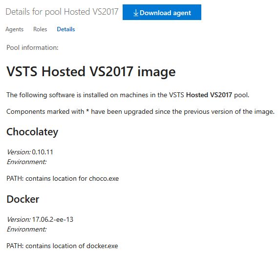
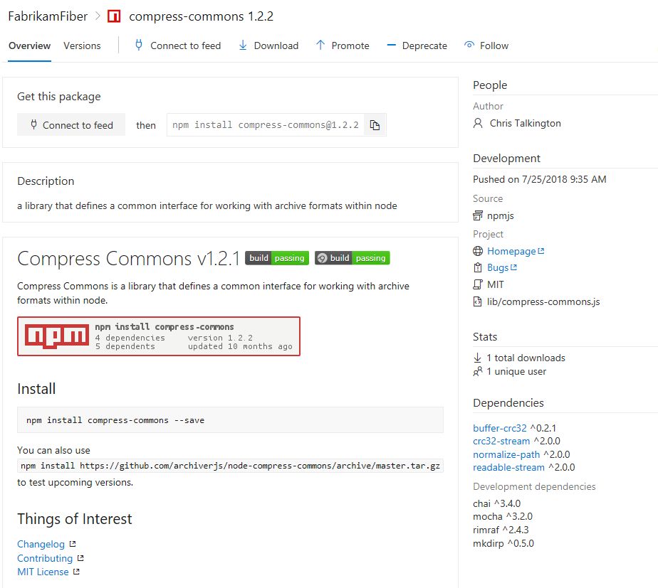

# Review summarized test results – VSTS Sprint 138 Update

In the **Sprint 138 Update** of Visual Studio Team Services (VSTS), the results pages for **Release** pipelines has been enhanced with a [summarized view of test results](#review-summarized-test-results) that organizes related outcomes into a hierarchy. Also in **Build and release**, we've added a way to [view the details](#check-installed-software-on-microsoft-hosted-agent-pools) of the installed software on Microsoft-hosted agent pools.

In **Work** you can now view your team's work on the Work Items hub. Check out the [Features](#features) list below for more.

## Next steps

Read about the new features below and head over to VSTS to try them for yourself.

> [!div class="nextstepaction"]
> [Go to VSTS](https://go.microsoft.com/fwlink/?LinkId=307137&campaign=o~msft~docs~product-vsts~release-notes)

## What’s new in VSTS

> [!VIDEO https://www.youtube.com/embed/8fQJ6u7JUjg?rel=0]

## Features

Wiki:

- [Surface metadata for wiki pages and code preview using YAML tags](#surface-metadata-for-wiki-pages-and-code-preview-using-yaml-tags)

Work:

- [View work for your team in the Work Items hub](#view-work-for-your-team-in-the-work-items-hub)

Build and release:

- [Check installed software on Microsoft-hosted agent pools](#check-installed-software-on-microsoft-hosted-agent-pools)

Test:

- [Review summarized test results](#review-summarized-test-results)

Package:

- [View package download and user metrics](#view-package-download-and-user-metrics)
- [Browse dependencies in npm packages](#browse-dependencies-in-npm-packages)

Reporting:

- [View VSTS dashboards within Microsoft Teams](#view-vsts-dashboards-within-microsoft-teams)
- [Investigate build history through a new build dashboard widget](#investigate-build-history-through-a-new-build-dashboard-widget)

Admin:

- [Manage billing for your organization directly through the Azure Portal](#manage-billing-for-your-organization-directly-through-the-azure-portal)

## Wiki

### Surface metadata for wiki pages and code preview using YAML tags

Adding metadata to documentation can help readers and search indexes pick up and surface meaningful content. In this update, any file that contains a YAML block in the beginning of the file will be transformed into a metadata table of one head and one row. The YAML block must take the form of valid YAML set between triple-dashed lines. It supports all basic data types, list, object as value. The syntax is supported in **Wiki** and code file preview.

YAML Tags example:

```json
---
tag: post
title: Hello world
---
```

> [!div class="mx-imgBorder"]
> 

YAML Tags example with list:

```json
---
tags:
- post
- code
- web
title: Hello world
---
```

> [!div class="mx-imgBorder"]
> 

## Work

### View work for your team in the Work Items hub

> [!IMPORTANT]
> The team is staging the rollout of this feature more than normal. You should see the new pivot in the **Work Items** hub of your organization soon.

You can now use the **My team(s)** pivot on the **Work Items** hub to find all of the work that is assigned to your team(s). With this pivot, you can quickly pick up work that is assigned to your team(s) or get a better idea of the work that you team(s) is responsible for. See the [View and add work items](/azure/devops/work/work-items/view-add-work-items?view=azure-devops&tabs=vertical) documentation for more information.

## Build and release

### Check installed software on Microsoft-hosted agent pools

The Microsoft-hosted agent pools now report what software is installed on the image. Not sure if you're running on Python 3.6.5 or Python 3.7, or whether the image has the latest Git build? Check the **Details** tab to find out. See the [Microsoft-hosted agents](/azure/devops/pipelines/agents/hosted?view=azure-devops) documentation for more information.

> [!div class="mx-imgBorder"]
> 

## Test

### Review summarized test results

> [!IMPORTANT]
> To use this capability, you must have the **New release progress views** [preview features](/azure/devops/project/navigation/preview-features) enabled on your profile.

During test execution, a test might spawn multiple instances of tests that contribute to the overall outcome. A few examples include: tests that [rerun due to failures](/azure/devops/release-notes/2017/dec-11-vsts#identify-flaky-tests), tests composed of an ordered combination of other tests (e.g. ordered test), or tests having different instances based on provided input parameter (data-driven tests). Since these tests are related they need to be reported together with the overall outcome derived based on the individual test outcomes. With this update, we introduce an improved version of test results presented as a hierarchy in the **Tests** tab on a release. Let's look at an example.

Earlier, we introduced the ability to [rerun failed tests](/azure/devops/release-notes/2017/dec-11-vsts#identify-flaky-tests) in the **VS Test** task. However, we only reported on the last attempt of a test, which somewhat limited the usefulness of this feature. We have now extended this feature to report each instance of the test execution as an attempt. Additionally, the Test Management API now supports the ability to publish and query hierarchical test results. See the [Test results API](/rest/api/vsts/test/results?view=vsts-rest-5.0) documentation for more information.

> [!div class="mx-imgBorder"]
> 
> 
> [!NOTE]
> Metrics in the test summary section (e.g. Total tests, Passed, etc.), are computed using the root level of the hierarchy rather than each individual iteration of the tests.

## Package

### View package download and user metrics

You can now track the number of times packages are downloaded and the number of unique users that have downloaded them. Each `npm install` or `nuget restore` by a person or build agent is considered a download. This can help you measure the popularity and usage of packages that you create. For example, if you see the total downloads of a package remain constant for 2 to 3 weeks that may be indication that a package isn't actively being used.

> [!div class="mx-imgBorder"]
> 

### Browse dependencies in npm packages

Previously, you used to be able to see the dependencies of a package, but you had to manually go back to the feed and locate it (if it was present at all). Now you can now click on a dependency (e.g. 'buffer-crc32' or 'normalize-path' in the right-hand column in the screenshot below) of an npm package and be taken directly to the list of available versions for that dependency.

> [!div class="mx-imgBorder"]
> 

## Reporting

### View VSTS dashboards within Microsoft Teams

You can now bring any of your VSTS dashboards into [Microsoft Teams](https://products.office.com/microsoft-teams/group-chat-software) to strengthen conversations with your team. To set this up, install the [Microsoft Teams Integration extension](https://marketplace.visualstudio.com/items?itemName=ms-vsts.vss-services-teams) and follow the instructions to select your dashboard. The selected dashboard will be added as a new tab in the Microsoft Teams channel. Dashboards are optimized for consumption and refresh every time you open the tab. You can drill into more details and take action in VSTS by clicking the links on selected widgets. See the [Microsoft Teams integration](/azure/devops/service-hooks/services/teams?view=azure-devops) documentation and the [post on Microsoft DevOps Blog](https://blogs.msdn.microsoft.com/devops/2018/08/09/make-your-visual-studio-team-services-dashboard-part-of-your-conversation-in-microsoft-teams/) for more information.

### Investigate build history through a new build dashboard widget

We have a new and improved build history widget that you can add to your dashboards. With this widget you can now view a history of builds from a specific branch on your dashboard and configure it on a public project for anonymous visitors.

> [!IMPORTANT]
> If you are looking for insights on your XAML builds, continue to use the older widget and read about [migrating from XAML builds to new builds](/azure/devops/pipelines/build/migrate-from-xaml-builds?view=azure-devops). Otherwise, we recommend that you move to the newer widget.

## Administration

### Manage billing for your organization directly through the Azure Portal

As a Project Collection Administrator (PCA) you can now [set up billing](/azure/devops/billing/set-up-billing-for-your-organization-vs) or [remove billing](/azure/devops/billing/change-azure-subscription?view=azure-devops#remove-your-billing-subscription) for an organization directly through the Azure Portal. Look for the new **Setup billing** and **Remove billing** commands on your organization in the portal.

## How to provide feedback

We would love to hear what you think about these features. Use the feedback menu to report a problem or provide a suggestion.

> [!div class="mx-imgBorder"]
> 

You can also get advice and your questions answered by the community on [Stack Overflow](https://stackoverflow.com/questions/tagged/vsts).

Thanks,

Aaron Bjork
