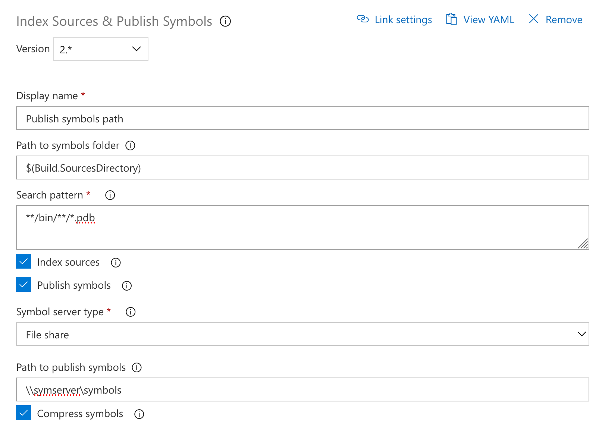
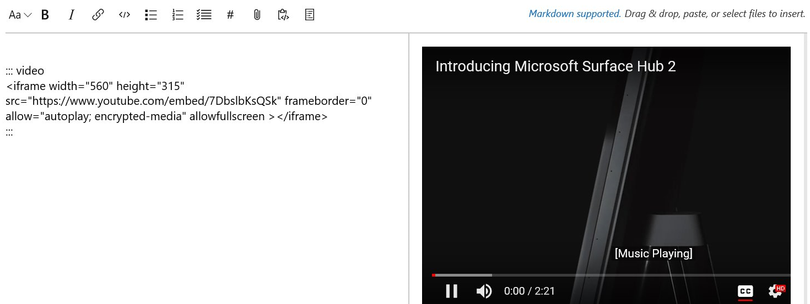
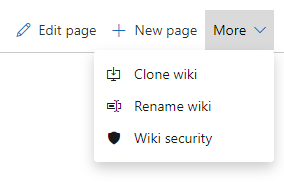
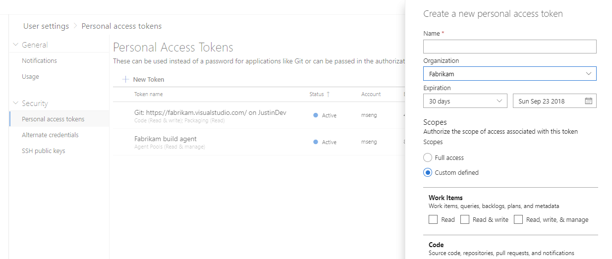

# Pipeline container jobs - Sprint 140 Update

In the **Sprint 140 Update** of Azure DevOps Services, you'll find a new way to customize build dependencies to your specific requirements with the introduction of [container jobs](#control-specific-build-dependencies-using-container-jobs) in Azure Pipelines. In Wiki you can now [add videos](#embed-a-video-in-wiki), [rename](#rename-a-wiki), and [insert a wiki table of contents from the format pane](#insert-a-wiki-table-of-contents-from-the-format-pane).

Check out the [Features](#features) list below for more.

## Features

Azure Pipelines:

- [Control specific build dependencies using container jobs](#control-specific-build-dependencies-using-container-jobs)
- [Enable code coverage in .NET Core task](#enable-code-coverage-in-net-core-task)

Azure Boards:

- [Leverage restructured Process REST APIs](#leverage-restructured-process-rest-apis)

Azure Artifacts:

- [Simplify authentication using the new cross-platform Credential Provider for NuGet](#simplify-authentication-using-the-new-cross-platform-credential-provider-for-nuget)
- [Store artifacts using Universal Packages](#store-artifacts-using-universal-packages)
- [Compress symbols when publishing to a file share](#compress-symbols-when-publishing-to-a-file-share)

Wiki:

- [Embed a video in wiki](#embed-a-video-in-wiki)
- [Rename a wiki](#rename-a-wiki)
- [Insert a wiki table of contents from the format pane](#insert-a-wiki-table-of-contents-from-the-format-pane)

Administration:

- [Manage your personal access tokens with filtering and paging](#manage-your-personal-access-tokens-with-filtering-and-paging)

## Next steps

> [!NOTE]
> These features will be rolling out over the next two to three weeks.

Read about the new features below and head over to Azure DevOps Services to try them for yourself.

> [!div class="nextstepaction"]
> [Go to Azure DevOps Services](https://go.microsoft.com/fwlink/?LinkId=307137&campaign=o~msft~docs~product-vsts~release-notes)

## Azure Pipelines

### Control specific build dependencies using container jobs

By default, jobs run on the host machine where the agent is installed. Container jobs, using the lightweight abstraction over the host operating system that containers provide, let you isolate your tools and dependencies inside a container instead. The agent will launch an instance of your specified container, then run steps inside it. You can select the exact versions of operating systems, tools, and dependencies that your build requires. See the [Container jobs](/azure/devops/pipelines/process/container-phases?view=azure-devops&tabs=yaml) documentation for more information.

### Enable code coverage in .NET Core task

The **.NET Core** task in Azure Pipelines now supports code coverage so that you can get a better handle of unit test coverage in your .NET Core projects. The "test" command of the .NET Core task can be passed the arguments `--collect "Code coverage"` to enable code coverage collection. Support is currently scoped to .NET Core projects targeting the Windows platform.

## Azure Boards

### Leverage restructured Process REST APIs

In the REST API version 5.1 (Preview) we combined several Inherited Process related APIs into a single domain. This will make it easier for you to find and consume the right endpoints. See the [Process Behaviors](/rest/api/vsts/processes/behaviors/list?view=vsts-rest-5.0) documentation for more information. We have also created a [few samples](https://github.com/microsoft/azure-devops-dotnet-samples/tree/master/ClientLibrary/Samples/WorkItemTrackingProcess) using the C# client libraries.

## Azure Artifacts

### Simplify authentication using the new cross-platform Credential Provider for NuGet

Interacting with authenticated NuGet feeds just got a lot better. The new .NET Core-based [Azure Artifacts Credential Provider](https://github.com/microsoft/artifacts-credprovider) works with msbuild, dotnet, and nuget(.exe) on Windows, macOS, and Linux. Any time you want to use packages from an Azure Artifacts feed, the Credential Provider will automatically acquire and store a token on behalf of the NuGet client you're using. You no longer need to manually store and manage a token in a configuration file.

To get the new provider, head to [GitHub](https://github.com/microsoft/artifacts-credprovider) and follow the instructions for your client and platform.

### Store artifacts using Universal Packages

Universal Packages are a new kind of package supported by Azure Artifacts. They provide a simple mechanism to store a collection of files in a feed with a package name and package version. The command line tooling is designed to efficiently transfer content from the client and service.

- Consider using Universal Packages to store artifacts such as:
- Configuration scripts and templates (e.g. ARM templates)
- Database snapshots for integration testing
- Machine learning training data and models
- Developer tools and SDKs
- 3D models and textures
- Build outputs

Jump over to our [quickstart guide to get started with Universal Packages](/azure/devops/artifacts/quickstarts/universal-packages).

### Compress symbols when publishing to a file share

We have updated the [Index & Publish Symbols task](/azure/devops/pipelines/tasks/build/index-sources-publish-symbols) to support compressing symbols when they are published to a file share.

> [!div class="mx-imgBorder"]
> 

As a reminder, you can also [publish symbols to Azure DevOps Services](/azure/devops/pipelines/symbols) instead of having to configure and manage a file server.

## Wiki

### Embed a video in wiki

Now you can embed videos in a wiki page from online services such as Microsoft Stream and YouTube. You can add the embedded video URL using the following syntax:

```markdown
::: video
<iframe width="560" height="315" src="https://www.youtube.com/embed/7DbslbKsQSk" frameborder="0" allow="autoplay; encrypted-media" allowfullscreen></iframe>
:::
```

> [!div class="mx-imgBorder"]
> 

This feature was prioritized based on a suggestion.

### Rename a wiki

Now you can rename your wiki in the wiki user interface and using REST APIs. From the **More** menu, click **Rename wiki** to give your wiki a memorable name. This feature was prioritized based on a [suggestion](https://developercommunity.visualstudio.com/content/problem/280480/renaming-a-team-project-did-not-rename-its-associa.html).

> [!div class="mx-imgBorder"]
> 

### Insert a wiki table of contents from the format pane

Last sprint we shipped the ability to [create table of contents](/azure/devops/release-notes/2018/aug-21-vsts#create-table-of-contents-for-wiki-pages) in wiki pages. You can now insert table of contents by clicking the appropriate button in the format pane when editing page.

> [!div class="mx-imgBorder"]
> 

## Administration

### Manage your personal access tokens with filtering and paging

As you've noticed with the new navigation in Azure DevOps, we're focused on bringing a more consistent experience across the service. We've taken this opportunity to help you better manage your personal access tokens (PATs), especially if you have several of them. Some of the new features include filter and paging controls when viewing all your PATs, a cleaner experience when creating a new PAT with grouping and descriptions for scopes, and the ability to edit and extend the expiration of existing PATs.

> [!div class="mx-imgBorder"]
> 

## How to provide feedback

We would love to hear what you think about these features. Use the feedback menu to report a problem or provide a suggestion.

> [!div class="mx-imgBorder"]
> 

You can also get advice and your questions answered by the community on [Stack Overflow](https://stackoverflow.com/questions/tagged/vsts).

Thanks,

Biju Venugopal
