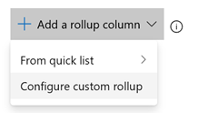
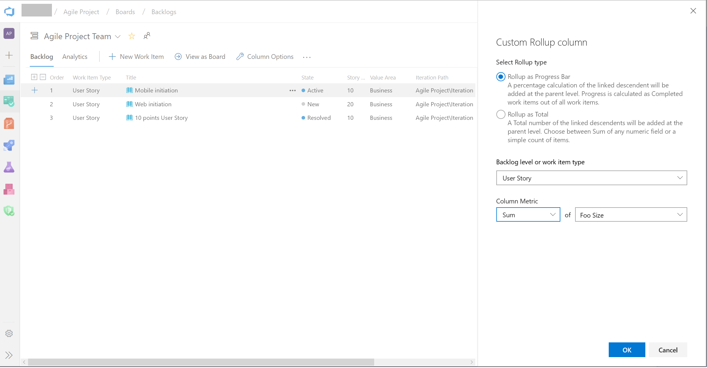
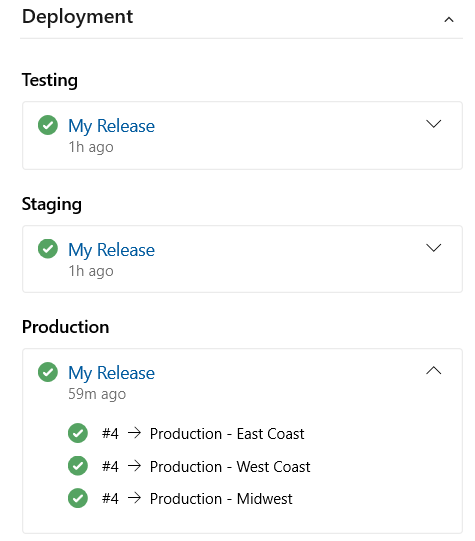

### Support for custom fields in Rollup columns

Rollup can now be done on any field, including custom fields. When adding a Rollup column, you can still pick a Rollup column from the Quick list, however if you want to rollup on numeric fields that are not part of the out of the box process template, you can configure your own as follows:
 
1. On your backlog click "Column options". Then in the panel click "Add Rollup column" and **Configure custom rollup**.
    > [!div class="mx-imgBorder"]
    > 
2. Pick between **Progress Bar** and **Total**.
3. Select a work item type or a Backlog level (usually backlogs aggregate several work item types).
4. Select the aggregation type. **Count of work items** or **Sum**. For Sum you'll need to select the field to summarize.
5. The **OK** button will bring you back to the column options panel where you can reorder your new custom column.

> [!div class="mx-imgBorder"]
> 

Note that you can't edit your custom column after clicking OK. If you need to make a change, remove the custom column and add another one as desired. 

### New rule to hide fields in a work item form based on condition 

We've added a new rule to the inherited rules engine to let you hide fields in a work item form. This rule will hide fields based on the users group membership. For example, if the user belongs to the "product owner" group, then you can hide a developer specific field. For more details see the documentation [here](https://docs.microsoft.com/azure/devops/organizations/settings/work/custom-rules?view=azure-devops).

### Custom work item notification settings

Staying up to date on work items relevant to you or your team is incredibly important. It helps teams collaborate and stay on track with projects and makes sure all the right parties are involved. However, different stakeholders have different levels of investment in different efforts, and we believe that should be reflected in your ability to follow the status of a work item. 

Previously, if you wanted to follow a work item and get notifications on any changes made, you would get email notifications for any and all changes made to the work item. After considering your feedback, we are making following a work item more flexible for all stakeholders. Now, you will see a new settings button next to the **Follow** button on the top right corner of the work item. This will take you to a pop up that will let you configure your follow options.

> [!div class="mx-imgBorder"]
> 

From **Notification Settings**, you can choose from three notification options. First, you can be completely unsubscribed. Second, you can be fully subscribed, where you get notifications for all work item changes. Lastly, you can choose to get notified for some of the top and crucial work item change events. You can select just one, or all three options. This will let team members follow work items at a higher level and not get distracted by every single change that gets made. With this feature, we will eliminate unnecessary emails and allow you to focus on the crucial tasks at hand.

> [!div class="mx-imgBorder"]
> 

### Link work items to deployments

We are excited to release a preview of the Deployment control on the work item form. This control links your work items to a release and enables you to easily track where your work item has been deployed. To learn more see the documentation [here](https://docs.microsoft.com/azure/devops/boards/work-items/work-item-deployments-control?view=azure-devops).

> [!div class="mx-imgBorder"]
> 
