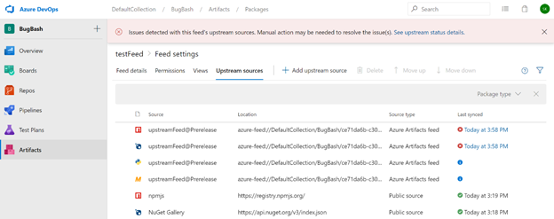
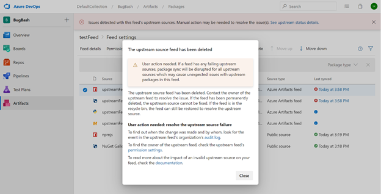
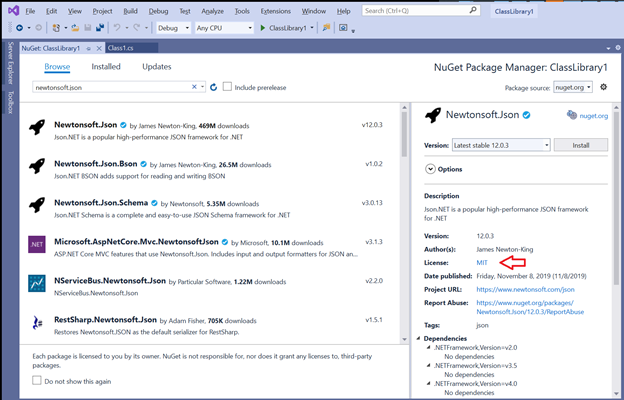
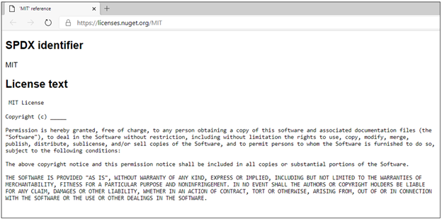

### Notifications for disabled upstream sources

The Azure Artifacts web interface now notifies you when one or more of your feed’s upstream sources is not functioning. Upstream sources enable you to point a feed (Feed A) to another feed (Feed B), and allow consumers of Feed A to access packages from Feed B without needing to connect directly to it. For more information about upstream sources, please see the Azure Artifacts <a href="https://docs.microsoft.com/azure/devops/artifacts/concepts/upstream-sources?view=azure-devops">documentation</a>. Upstream sources may not function if they are disabled at the source, for example if Feed B is
silently deleted, customers will not be able to fetch packages from it through Feed A. In the past, this situation could happen without warning, and lead to difficult-to-diagnose operational problems such as sudden build breaks due to
missing dependencies (i.e. packages sourced from Feed B in the example above). Now, Azure Artifacts will provide a warning to you when there are problems with any upstream sources of your feeds. When a problem exists, you will see a
banner (red arrow below) in the Azure Artifacts feed detail page.

Clicking on the link in the banner will open a page which shows the status of each upstream source your feed. In addition to information about each upstream source for the current feed, you can see the current status under the "Last synced" column. Upstream sources that are working properly will show a green checkmark with the last time the source's health was verified. Upstream sources that are broken will show a red X along with the time it was checked. Upstream sources that are pending verification will show a blue information icon.

When you click on the last sync time for a broken upstream source, a dialog will open sharing more details about the root
cause of the problem (if available). For example, in the picture below, the upstream source in question is not functioning because the target feed was deleted. The dialog also contains a link to the audit log, to help you understand who has made relevant changes recently. Links to the permissions settings and the Azure Artifacts documentation can also be used to help investigate the root cause.

### License expressions and embedded licenses

Now you can see the details of license information for NuGet packages stored in Azure Artifacts while browsing packages in Visual Studio. This applies to licenses which are represented using license expressions or embedded licenses. Now you can see a link to the license information in the Visual Studio package details page (red arrow in the image
below).

Clicking on the link will take you to a web page where you can view the details of the license. This experience is the same for both license expressions and embedded licenses, so you can see license details for packages stored in Azure Artifacts in one place (for packages which specify license information and are supported by Visual Studio).

### Lightweight authentication tasks

You can now authenticate with popular package managers from Azure Pipelines using light-weight authentication tasks. This includes NuGet, npm, PIP, Twine, and Maven. Previously, you could authenticate with these package managers using tasks which provided a large amount of functionality, including the ability to publish and download packages. However, this required using these tasks for all activities which interacted with the package managers. If you had your own scripts to run for performing tasks like publishing or downloading packages, you would not be able to use them in your Pipeline. Now, you can use scripts of your own design in your pipeline YAML and perform authentication with these new lightweight tasks. An example using npm:

The use of the "ci" and "publish" command in this illustration are arbitrary, you could use any commands supported by Azure Pipelines YAML. This enables you to have complete control of command invocation and makes it easy to use shared scripts in your pipeline configuration. For more information, please see the [NuGet](https://docs.microsoft.com/azure/devops/pipelines/tasks/package/nuget-authenticate?view=azure-devops), [npm](https://docs.microsoft.com/azure/devops/pipelines/tasks/package/npm-authenticate?view=azure-devops), [PIP](https://docs.microsoft.com/azure/devops/pipelines/tasks/package/pip-authenticate?view=azure-devops), [Twine](https://docs.microsoft.com/azure/devops/pipelines/tasks/package/twine-authenticate?view=azure-devops), and [Maven](https://docs.microsoft.com/azure/devops/pipelines/tasks/package/maven-authenticate?view=azure-devops) authentication task documentation.
